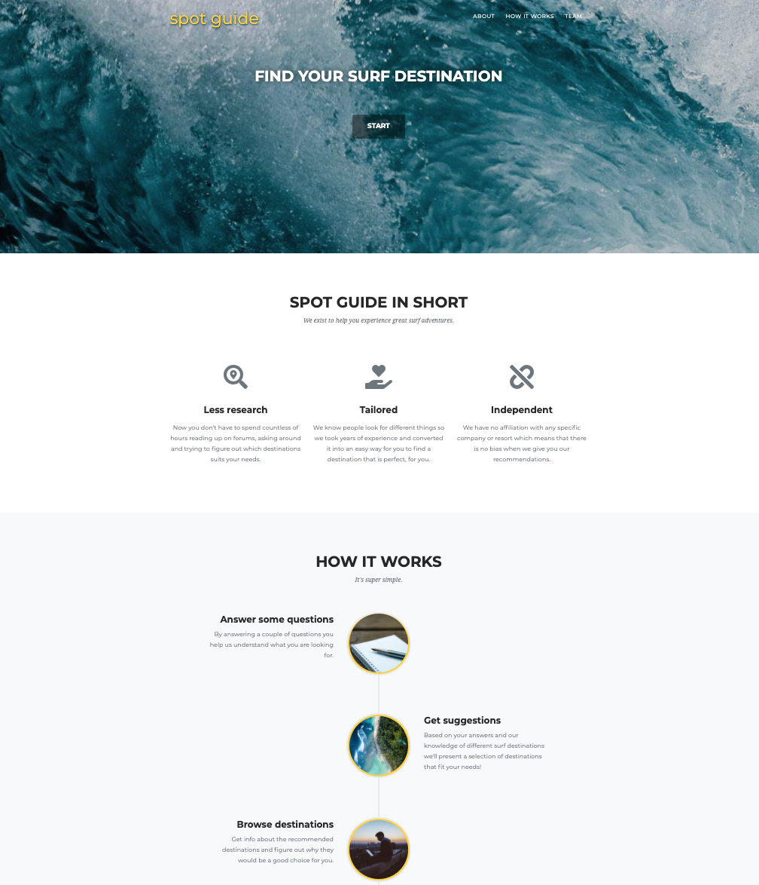

# Spot-Guide
Responsive travel website built with Django. The goal was to create a flexible wizard style Q&amp;A that could be updated with new information through the built in admin GUI. 

## Screenshot
</img>

## Screenshot (admin)
</img>
